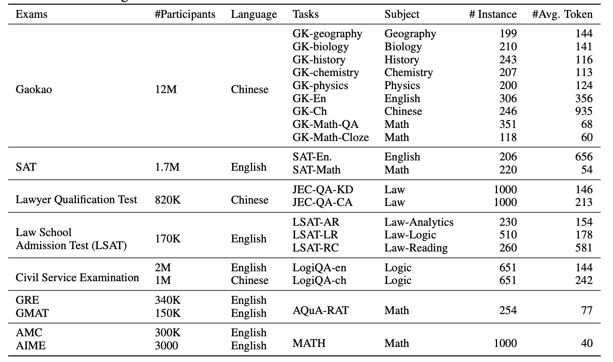

# AGIEval
This repository contains information about AGIEval, data, code and output of baseline systems for the benchmark.

# Introduction
AGIEval is a human-centric benchmark specifically designed to evaluate the general abilities of foundation models in tasks pertinent to human cognition and problem-solving. 
This benchmark is derived from 20 official, public, and high-standard admission and qualification exams intended for general human test-takers, such as general college admission tests (e.g., Chinese College Entrance Exam (Gaokao) and American SAT), law school admission tests, math competitions, lawyer qualification tests, and national civil service exams. 
For a full description of the benchmark, please refer to our paper: [AGIEval: A Human-Centric Benchmark for
Evaluating Foundation Models](https://arxiv.org/pdf/2304.06364.pdf).

# Tasks and Data

AGIEval v1.0 contains 20 tasks, including two cloze tasks (Gaokao-Math-Cloze and MATH) and 18 multi-choice question answering tasks (the rest). Among the multi-choice question answering tasks, Gaokao-physics and JEC-QA have one or more answers, and the other tasks only have one answer. You can find the full list of tasks in the table below.


You can download all post-processed data in the [data/v1](data/v1) folder. All usage of the data should follow the license of the original datasets. We provide the citation information of the original datasets in the Citation section below. 

The data format for all datasets is as follows:
```
{
    "passage": null,
    "question": "设集合 $A=\\{x \\mid x \\geq 1\\}, B=\\{x \\mid-1<x<2\\}$, 则 $A \\cap B=$ ($\\quad$)\\\\\n",
    "options": ["(A)$\\{x \\mid x>-1\\}$", 
        "(B)$\\{x \\mid x \\geq 1\\}$", 
        "(C)$\\{x \\mid-1<x<1\\}$", 
        "(D)$\\{x \\mid 1 \\leq x<2\\}$"
        ],
    "label": "D",
    "answer": null
}
```
The `passage` field is available for gaokao-chinese, gaokao-english, both of logiqa, all of LSAT, and SAT. The answer for multi-choice tasks is saved in the `label` field. The answer for cloze tasks is saved in the `answer` field. 

We provide the prompts for few-shot learning in the [data/v1/few_shot_prompts](data/few_shot_prompts.csv) file.
# Baseline Systems
We evaluate the performance of the baseline systems on AGIEval v1.0. The baseline systems are based on the following models: text-davinci-003, ChatGPT (gpt-3.5-turbo), and GPT-4.
You can replicate the results by following the steps below:
1. fill in your OpenAI API key in the [openai_api.py](openai_api.py) file.
2. run the [run_prediction.py](run_prediction.py) file to get the results.

# Model Outputs
You can download the zero-shot, zero-shot-Chain-of-Thought, few-shot and few-shot-Chain-of-Thought outputs of the baseline systems for the first version of AGIEval in the [Onedrive](https://1drv.ms/u/s!Amt8n9AJEyxcg8YQKFm1rSEyV9GU_A?e=VEfJVS) link. 
# Evaluation
You can run the [post_process_and_evaluation.py](post_process_and_evaluation.py) file to get the evaluation results.
# Leaderboard
Thanks to OpenCompass who collects the results of multiple models on AGIEval, you can refer to the [leaderboard](https://opencompass.org.cn/dataset-detail/AGIEval) for the latest results.
# Citation
If you use AGIEval dataset or the code in your research, please cite our paper:
```
@misc{zhong2023agieval,
      title={AGIEval: A Human-Centric Benchmark for Evaluating Foundation Models}, 
      author={Wanjun Zhong and Ruixiang Cui and Yiduo Guo and Yaobo Liang and Shuai Lu and Yanlin Wang and Amin Saied and Weizhu Chen and Nan Duan},
      year={2023},
      eprint={2304.06364},
      archivePrefix={arXiv},
      primaryClass={cs.CL}
}
```
Please make sure to cite all the individual datasets in your paper when you use them. We provide the relevant citation information below:
```
@inproceedings{ling-etal-2017-program,
    title = "Program Induction by Rationale Generation: Learning to Solve and Explain Algebraic Word Problems",
    author = "Ling, Wang  and
      Yogatama, Dani  and
      Dyer, Chris  and
      Blunsom, Phil",
    booktitle = "Proceedings of the 55th Annual Meeting of the Association for Computational Linguistics (Volume 1: Long Papers)",
    month = jul,
    year = "2017",
    address = "Vancouver, Canada",
    publisher = "Association for Computational Linguistics",
    url = "https://aclanthology.org/P17-1015",
    doi = "10.18653/v1/P17-1015",
    pages = "158--167",
    abstract = "Solving algebraic word problems requires executing a series of arithmetic operations{---}a program{---}to obtain a final answer. However, since programs can be arbitrarily complicated, inducing them directly from question-answer pairs is a formidable challenge. To make this task more feasible, we solve these problems by generating answer rationales, sequences of natural language and human-readable mathematical expressions that derive the final answer through a series of small steps. Although rationales do not explicitly specify programs, they provide a scaffolding for their structure via intermediate milestones. To evaluate our approach, we have created a new 100,000-sample dataset of questions, answers and rationales. Experimental results show that indirect supervision of program learning via answer rationales is a promising strategy for inducing arithmetic programs.",
}

@inproceedings{hendrycksmath2021,
  title={Measuring Mathematical Problem Solving With the MATH Dataset},
  author={Dan Hendrycks and Collin Burns and Saurav Kadavath and Akul Arora and Steven Basart and Eric Tang and Dawn Song and Jacob Steinhardt},
  journal={NeurIPS},
  year={2021}
}

@inproceedings{Liu2020LogiQAAC,
  title={LogiQA: A Challenge Dataset for Machine Reading Comprehension with Logical Reasoning},
  author={Jian Liu and Leyang Cui and Hanmeng Liu and Dandan Huang and Yile Wang and Yue Zhang},
  booktitle={International Joint Conference on Artificial Intelligence},
  year={2020}
}

@inproceedings{zhong2019jec,
  title={JEC-QA: A Legal-Domain Question Answering Dataset},
  author={Zhong, Haoxi and Xiao, Chaojun and Tu, Cunchao and Zhang, Tianyang and Liu, Zhiyuan and Sun, Maosong},
  booktitle={Proceedings of AAAI},
  year={2020},
}

@article{Wang2021FromLT,
  title={From LSAT: The Progress and Challenges of Complex Reasoning},
  author={Siyuan Wang and Zhongkun Liu and Wanjun Zhong and Ming Zhou and Zhongyu Wei and Zhumin Chen and Nan Duan},
  journal={IEEE/ACM Transactions on Audio, Speech, and Language Processing},
  year={2021},
  volume={30},
  pages={2201-2216}
}
```


# Contributing
This project welcomes contributions and suggestions.  Most contributions require you to agree to a
Contributor License Agreement (CLA) declaring that you have the right to, and actually do, grant us
the rights to use your contribution. For details, visit https://cla.opensource.microsoft.com.

When you submit a pull request, a CLA bot will automatically determine whether you need to provide
a CLA and decorate the PR appropriately (e.g., status check, comment). Simply follow the instructions
provided by the bot. You will only need to do this once across all repos using our CLA.

This project has adopted the [Microsoft Open Source Code of Conduct](https://opensource.microsoft.com/codeofconduct/).
For more information see the [Code of Conduct FAQ](https://opensource.microsoft.com/codeofconduct/faq/) or
contact [opencode@microsoft.com](mailto:opencode@microsoft.com) with any additional questions or comments.

# Trademarks

This project may contain trademarks or logos for projects, products, or services. Authorized use of Microsoft 
trademarks or logos is subject to and must follow 
[Microsoft's Trademark & Brand Guidelines](https://www.microsoft.com/en-us/legal/intellectualproperty/trademarks/usage/general).
Use of Microsoft trademarks or logos in modified versions of this project must not cause confusion or imply Microsoft sponsorship.
Any use of third-party trademarks or logos are subject to those third-party's policies.
